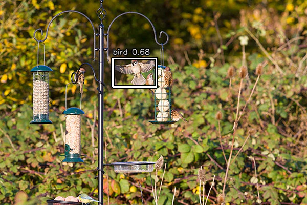

# BirdSpotter

## Motivation

BirdSpotter watches a V4L2 camera for birds and saves the best detection from
each five-minute window as a transparent PNG. It uses a bird-only YOLO26s
OpenVINO detector followed by SAM 2.1 Large OpenVINO segmentation.

| Bird detection | Final transparent bird |
| --- | --- |
|  |  |

## Setup

Python 3.12.13 and `uv` are required. Create the lean runtime environment:

```bash
uv sync --locked
```

The default `.venv` is for runtime, tests, and deployment. Runtime model files
belong in `weights/` and are not committed to Git.

## Export

Model export uses a separate environment so Torch, Ultralytics, and regular
OpenCV do not affect the runtime environment:

```bash
UV_PROJECT_ENVIRONMENT=.venv-export uv sync --locked --group export
UV_PROJECT_ENVIRONMENT=.venv-export \
  uv run --locked --group export python scripts/export_models.py
```

The exporter downloads and verifies YOLO26s and SAM 2.1 Large checkpoints,
then writes OpenVINO artifacts to `weights/`. Source checkpoints are stored in
ignored `weights_dev/`. Pass `--calibration-data path/to/dataset.yaml` to use
different detector calibration data.

## Demo

Regenerate the five demo annotations and segmentations:

```bash
uv run python scripts/generate_demo.py
```

## Deployment

```bash
uv run python scripts/deploy.py
```

By default, the camera is requested at 1600×896 MJPEG and 5 fps; the detector
uses 1088×1920 input and runs once per second. SAM runs once for the strictly
highest-confidence bird in each five-minute window. Outputs are written to
`segmented/bird_conf_XX_ts_YYYY-MM-DD_HH-MM.png`.

Use `--log-level DEBUG` for per-frame detector timing and selection logs.

## Tests and checks

```bash
uv run pytest
uv run pre-commit run --all-files
```

The type-check hook uses `.venv-export` automatically.

## Licensing

`LICENSE.md` covers BirdSpotter's original code. SAM 2.1 and YOLO26 checkpoints
and derived artifacts remain subject to their upstream licences; see
[third-party model notices](THIRD_PARTY_NOTICES.md) before distributing them.
