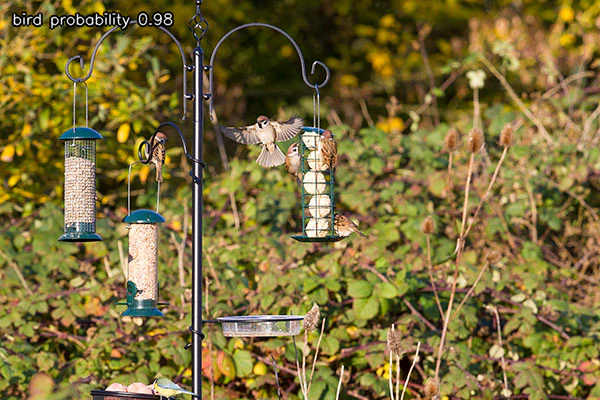
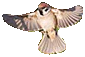

# BirdSpotter

BirdSpotter watches a camera, and uses computer vision to make bird cutouts.

It uses MobileNetV4 followed by SAM 3.

| Classification | Segmentation |
| --- | --- |
|  |  |

## Setup

```bash
uv sync --locked
```

```bash
uv run python scripts/download_models.py
```

## Demo

```bash
uv run python scripts/generate_demo.py
```

## Deployment

```bash
uv run python scripts/deploy.py
```

## Tests and checks

```bash
uv run pytest
uv run pre-commit run --all-files
```
