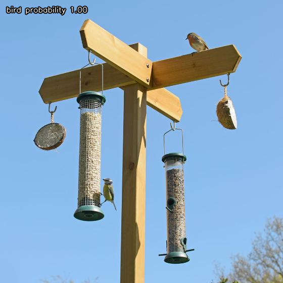
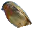

# BirdSpotter

BirdSpotter watches a camera, and uses computer vision to make bird cutouts. 

It uses a single-output MobileNetV4 Conv Large classifier to identify frames containing birds, then SAM 3 segments the
highest-confidence bird from the whole frame using the fixed text prompt `bird`.
The classifier scores the whole frame; SAM 3 supplies bird localization. The OpenVINO model uses 504 x 504 input
and W8A16 weight compression.

| Bird classification | Final transparent bird |
| --- | --- |
|  |  |

## Setup

0) Install `uv` (https://docs.astral.sh/uv/getting-started/installation/#standalone-installer)
1) Sync the dependencies
```bash
uv sync --locked
```
2) Export SAM 3 (requires access to `facebook/sam3` on Hugging Face)
```bash
uv sync --group ml
uv run --group ml python -m birdspotter.ml.sam3_export --device cuda
```
Use `--device cpu` when exporting without an NVIDIA GPU. Deployment needs only
the generated files in `weights/sam3/openvino-504/`, not PyTorch or Transformers.

3) Train the classifier below, install its OpenVINO export, and check SAM 3
```bash
uv run python scripts/download_models.py
```

To download a packaged custom SAM 3 export instead, pass
`--sam3-repository OWNER/REPOSITORY` to `scripts/download_models.py`. Package
an export with `uv run python scripts/ml/package_hf_sam3.py`.

## Demo

Regenerate demo annotations and segmentations. Classifier-negative images are skipped:

```bash
uv run python scripts/generate_demo.py
```

## Deployment

```bash
uv run python scripts/deploy.py
```

Deployment keeps the most confident classifier-positive frame in each five-minute
window, then runs SAM 3 on that frame. If SAM 3 finds no confident bird, the
frame is skipped. Camera ROI settings still apply before classification and segmentation.

Deployment creates a web page at `http://HOSTNAME:8080`.

In `Recent sightings`, view the 10 most recently seen birds.

In `Area of interest`, draw the region of interest that classification uses.

## Tests and checks

```bash
uv run pytest
uv run pre-commit run --all-files
```

## Classifier training on Modal

Launch with `modal run --detach`. The local entrypoint submits training with
`.spawn()`, prints the app URL and call ID, writes the submission details to
`data/modal-runs/<call-id>.json`, and exits without waiting for training. Keep
`--detach` so the remote app continues after the launcher exits. Monitor with
`uv run --group ml modal app logs APP_ID -f` or W&B.

Build directly from Open Images, COCO, VOC, Birdsnap, and NABirds:

```bash
uv run --group ml python scripts/ml/build_source_classifier_dataset.py
tar -czf data/archives/classifier_birds.tar.gz -C data/processed/classifier_birds train val
uv run --group ml modal volume put birdspotter-training data/archives/classifier_birds.tar.gz /datasets/
uv run --group ml modal run --detach scripts/ml/train_mobilenetv4_modal.py
uv run --group ml modal volume get birdspotter-training /runs/mobilenetv4-bird-640 ./trained-model
mkdir -p weights/classifier/mobilenetv4-bird-640-openvino
cp trained-model/openvino/* weights/classifier/mobilenetv4-bird-640-openvino/
```

Training uses an A100 80 GB and defaults to 640 x 640 with batch size 32. Rebuild any dataset previously
saved at 224 x 224 into a new output directory; enlarging those images cannot
recover detail. Training resolution is saved in the checkpoint and used for
OpenVINO export. Deployment reads the input size from the exported model.

Training uses channels-last memory layout and cuDNN autotuning to accelerate
convolutions. Initial batches include kernel benchmarking; W&B records both settings.
Torchvision decodes RGB images into uint8 tensors in four persistent data-loader
workers. Batches are transferred to the GPU before per-image random augmentation
and float32 normalization; validation uses deterministic normalization. GPU
brightness/contrast uses float arithmetic rather than PIL's uint8 rounding.

The model emits one bird logit; sigmoid converts it to bird probability. Training
uses binary cross-entropy with bird=1 and no_bird=0 targets. Training applies
random horizontal flips (50% probability) and mild brightness/contrast jitter
(factors 0.9–1.1). Validation and inference use deterministic preprocessing.

The source builder writes `train/bird`, `train/no_bird`, `val/bird`, and
`val/no_bird`; folder names are classification labels, with targets recorded in
`manifest.jsonl`. COCO and VOC provide annotated no-bird images. COCO negatives are capped at
three per COCO bird image (`--coco-negative-ratio 3`). The selection is stable
across resumes; already downloaded excess negatives are moved to `.excluded/`
and removed from the active manifest, so training and packaging exclude them. The other
sources provide positive examples. Images retain their whole frame, letterboxed
to 640 x 640 by default. Use `--sources coco2017 voc2012 --limit-per-source 100`
for a small build, or `--output-dir`, `--source-cache`, `--width`, and `--height`
to change the output. Downloads and manifest-based progress are resumable. TQDM bars show download
bytes and source progress; finite batches show remaining time, while streaming
sources show processed counts and rates without guessing a total.

Lightning logs training and validation loss, accuracy, bird precision, and recall
to W&B and local CSV files. W&B uses the `birdspotter-mobilenetv4` project and
the training run name. Set `--wandb-project` and `--wandb-entity` to customize it.
The run ID is saved in `wandb-run.json` on the Modal volume and reused on resume.
Create the Modal `wandb-secret` containing `WANDB_API_KEY` before training
if it is not already configured. Checkpoints remain on the Modal volume.
Training fine-tunes ImageNet weights and saves
`best.pt` by validation loss, and exports static batch-one OpenVINO with FP16 weights.
Use `--image-size`, `--epochs`, `--batch-size`, `--dataset-tar`, and `--run-name` to customize a run.
Use `--model-variant small` to train MobileNetV4 Conv Small; the default is `large`.
Checkpoints record the variant, and OpenVINO export uses the matching architecture.
BF16 mixed precision (`bf16-mixed`) is the default. Use `--precision 16-mixed`
for FP16 mixed precision or `--precision 32-true` for full precision. Lightning saves best and last checkpoints, including
optimizer state, under `checkpoints/` and commits them to the Modal volume.
New runs use per-optimizer-step linear warmup from 3e-5 to 3e-4 over the first
epoch, then cosine decay to 3e-6 over the remaining epochs. W&B and CSV log the
learning rate. Resume restores the original schedule and duration; legacy
checkpoints without a schedule retain their constant learning rate.
Resume with the same run name and a larger total epoch count:

```bash
uv run --group ml modal run --detach scripts/ml/train_mobilenetv4_modal.py \
  --resume-checkpoint /runs/mobilenetv4-bird-640/checkpoints/last.ckpt --epochs 20
```

The default bird probability threshold is 0.5; tune `--confidence` on representative
held-out camera frames, particularly small birds and hard negative scenes.
No classifier weights are bundled; training must complete before deployment.
A published classifier export can be installed using `--classifier-repository` with
an `openvino/` artifact folder.

## Hugging Face packages and uploads

Authenticate once using `uv run --group ml hf auth login`, or set `HF_TOKEN`.
Create local packages for review:

```bash
uv run --group ml python scripts/ml/package_hf_dataset.py
uv run --group ml python scripts/ml/package_hf_sam3.py
uv run --group ml python scripts/ml/package_hf_classifier.py
```

Packages go to `dist/huggingface/` and contain a README card plus SHA-256 manifest.
The classification dataset archive contains ImageFolder splits and excludes source
caches. Counts and saved resolutions are read from the actual images. SAM 3 uses
`openvino-504/`; MobileNetV4 uses `openvino/`, matching the model downloader.
Optionally include the matching PyTorch checkpoint with `--checkpoint trained-model/best.pt`.

Upload the reviewed packages:

```bash
uv run --group ml python scripts/ml/package_hf_dataset.py --upload-only --repo-id PBatch23888/birds-classification
uv run --group ml python scripts/ml/package_hf_sam3.py --upload-only --repo-id PBatch23888/birdspotter-sam3-openvino
uv run --group ml python scripts/ml/package_hf_classifier.py --upload-only --repo-id PBatch23888/birdspotter-mobilenetv4
```

Use `--upload` to package and upload in one command. Each script supports
`--output-dir` and custom `--repo-id`; datasets use `--dataset-dir`, models use
`--openvino-dir`. New repositories are public unless `--private` is supplied;
existing repository visibility is preserved. Packaging refuses a nonempty output
directory, so use a new directory when preparing an updated package.
Private repositories can be downloaded with authenticated `hf download` commands;
the deployment model downloader currently targets public repositories.
